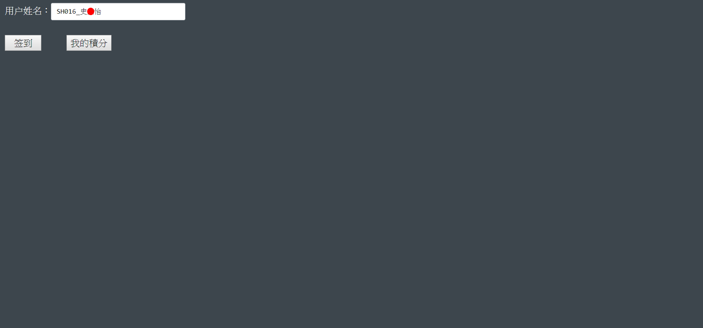
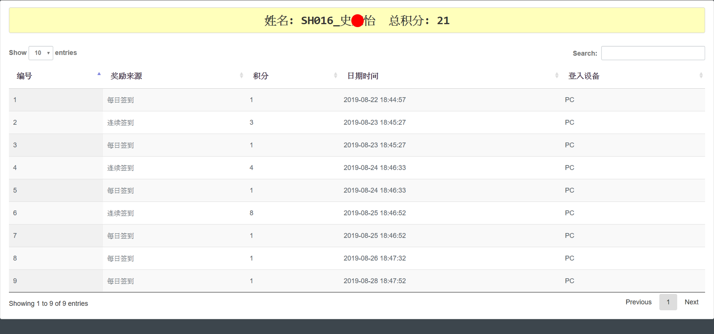

# 簽到積分系統

### 簽到主頁

### 積分列表

## 功能
### 簽到主頁
* 用戶輸入其姓名後會判斷資料庫中是否有該用戶的基本資料。  
  * 若輸入的用戶姓名尚未註冊或今日已簽到，則彈出警告窗，並清空輸入欄的內容。  
  * 若為已註冊的用戶，則系統將會去判斷今日的簽到是否為連續簽到、是第幾天連續簽到，並計算應得的積分。  
* 點取"我的積分"按鈕，可跳轉至積分列表，並查看積分狀況。  

### 積分列表
* 藉由前一個頁面所輸入的姓名，將該用戶積分獲取的歷史紀錄條列出來。  
* 每筆記錄將顯示該次積分的獎勵來源、獲取獎勵的時間以及用戶當下的登入設備。  
* 在列表的最上方會顯示用戶的姓名以及總積分。
